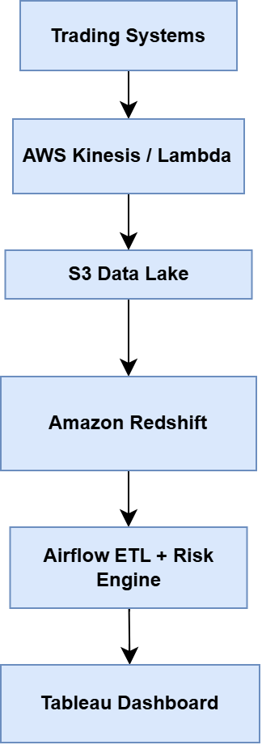
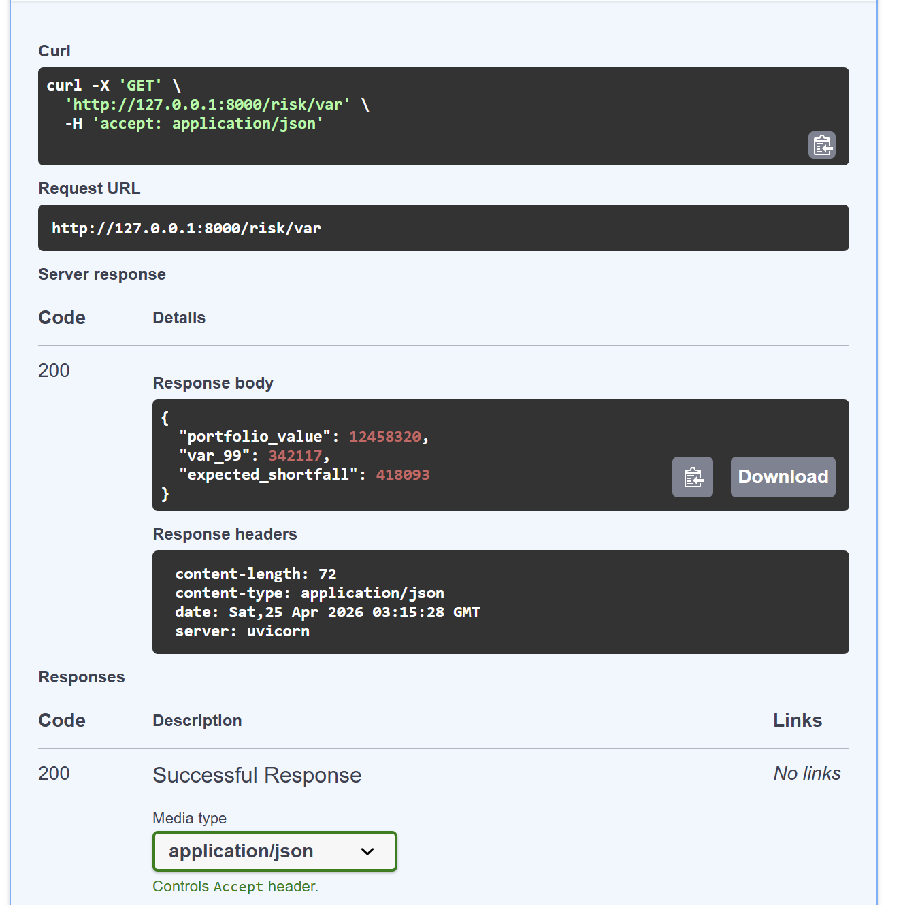
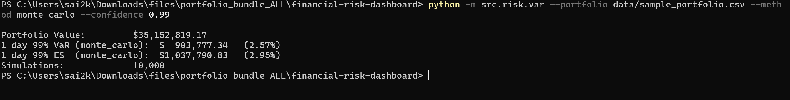

# 📊 Financial Risk & Portfolio Dashboard

End-to-end financial risk analytics platform that computes **Value-at-Risk (VaR)** and **Expected Shortfall (ES)**, exposes results via a **FastAPI service**, and visualizes insights using **Tableau dashboards**.

---

## 🚀 Live API (Dockerized)

Run locally using Docker:

```bash
docker build -t financial-risk-api .
docker run -p 8000:8000 financial-risk-api
```

👉 [Open API Docs](http://localhost:8000/docs)

---

## 📈 Features

* 📊 Portfolio risk analytics (VaR, Expected Shortfall)
* ⚡ FastAPI-based REST API
* 🐳 Fully Dockerized deployment
* 🔄 Data pipeline with Apache Airflow
* 📉 Tableau dashboards for visualization
* 📦 Modular project structure (production-ready)

---

## 🏗️ Architecture



---

## 🔌 API Preview



---

## 📊 Dashboard Demo



---

## 🛠️ Tech Stack

| Layer         | Tools                       |
| ------------- | --------------------------- |
| Ingestion     | AWS Lambda, Kinesis, Python |
| Storage       | S3 (Parquet), Redshift      |
| Transform     | Python, SQL, dbt            |
| Orchestration | Apache Airflow              |
| Modeling      | NumPy, pandas, SciPy        |
| API           | FastAPI                     |
| Visualization | Tableau                     |
| Deployment    | Docker                      |

---

## 📂 Project Structure

```bash
financial-risk-dashboard/
│── api/            # FastAPI service
│── airflow/        # DAGs for pipeline orchestration
│── data/           # Sample datasets
│── docs/           # Images for README
│── src/            # Core risk calculations
│── dashboards/     # Tableau dashboards
│── Dockerfile      # Containerization
│── requirements.txt
│── README.md
```

---

## 📌 Key Highlights

* Built a **production-style data pipeline**
* Implemented **risk models used in finance industry**
* Designed **API-first architecture**
* Demonstrated **end-to-end system thinking**

---

## 📬 Author

**Sai Kiran Konda**
GitHub: https://github.com/saikirankonda99

---
